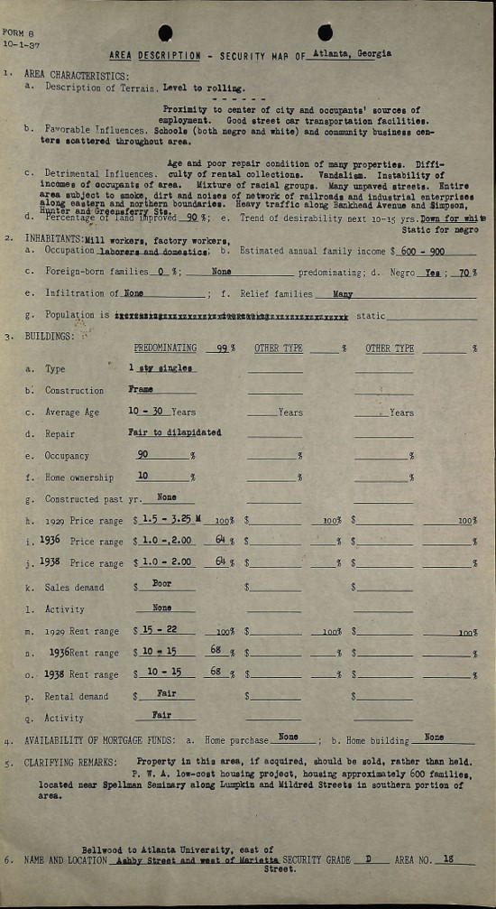

This page contains a collection of my current and past projects.

## HOLC City Survey Program
My ongoing dissertation project studies the 1930s HOLC mapping program.

 

<iframe
    width="800"
    height="450"
    src= holc_map.html>
</iframe>

"https://snmarkley1.github.io/holc_map.html"
